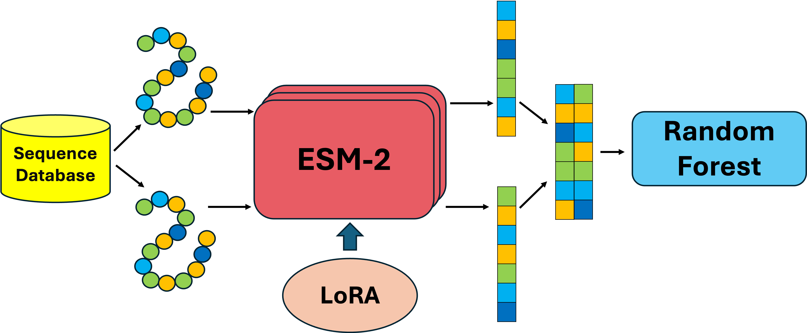

# ESM2RF
Our program aims to develop a LoRA-adapted ESM-2 pre-trained model combined with a random forest classifier to predict protein-protein interactions (PPIs) within the MADS-box protein family.

This is a brief introduction.
## Installation
```
conda env create --file environment.yml
conda activate esm2
```
## Usage
### Data split
Firstly Run to have a fixed experiment group
```
python split.py
```
### Training and evaluation
Example
```
python main.py --model_size 6 --use_lora --use_bayesian_opt --use_grid_search
```
## Output
### checkpoint
```
checkpoint/
├── embeddings/
│   └── embeddings.npz
├── lora_checkpoint.pt
└── results_lora.pkl

```
+ For use LoRA：
  + `lora_checkpoint.pt` includes LoRA training process config and statistic --training
  + `results_lora.pkl` includes full training process and history -- visualizition
  + `embeddings.npz` includes the ESM-2 generate embeddings (X:combined emb,y:labels) -- downstream work
+ For default ESM:
  +  `embeddings.npz`

### output
```
output/
└──model size/
   └──experiment_method type/
      ├──roc cureves.png
      ├──confusion matrix.png
      ├──calibration curve.png
      ├──metrics.png
      ├──partition_evaluation.json
      └──PCA.png
```
